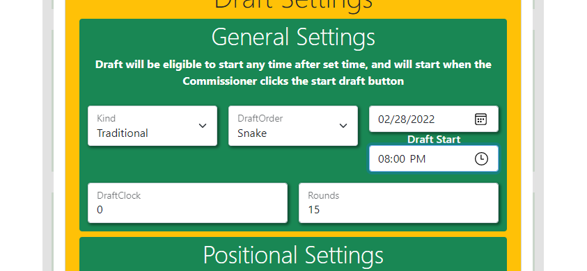
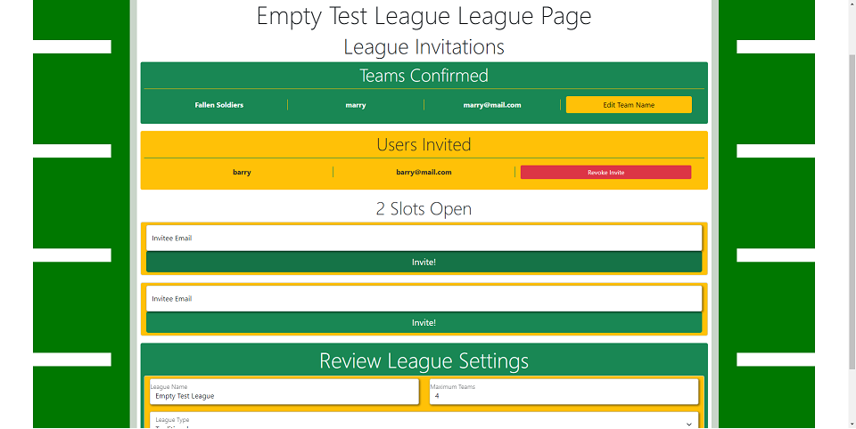

# FantasyDraftGo


## A fantasy football draft with Gin and React

FantasyDraftGo is an elaboration on [FantasyDraft](https://github.com/PhiloTFarnsworth/FantasyDraftPrototype), rewritten using Go's Gin web framework and React.

A demonstration of FantasyDraftGo's abilities can be seen [on Youtube.](https://youtu.be/L6jHyUtb-ZA)

### What can FantasyDraftGo do?
Users can
* Create Fantasy Football Leagues
* Invite other FantasyDraft users as well as unregistered users
* Customize their league settings, including rules for rosters and scoring.
* Participate in real-time drafts and chat 'smack' during the event.

This version includes all the features of the original FantasyDraft along with a shinier UI.

> Draft your favorite NFL players like Blaine Gabbert!


### What else is new?
FantasyDraftGo not only runs leaner, but it also runs more securely, with testing suites on the backend using Go's built-in testing packages to Playwright testing on the front end.  These tests not only give some security in verifying working components, they also allow faster iteration by streamlining the testing process.  Gin and a select number of modular packages provides much of the functionality of Django while keeping out some of the overhead.  Instead of replacing the ORM from Django with a similar system, I instead focused on managing our SQL with golang's mysql package, allowing plenty of opportunities to dive in mySQL's documentation.  Finally the front end has received a little polish, and now utilizes several modern javascript tools to provide a more compatible and reliable browsing experience.

> Customize your draft and league settings!  Fumbles only league?  You got it!


### Server Side Arrangement
* Golang
  * Gin Framework
    * Gin packages (Sessions, CSRF)
    * Gorilla (Websocket, Secure Cookie)
  * Other packages (Crypto, Net, etc.)

The challenge of rewriting in Go was abated by using Gin which gives you a fair bit of useful tools and conventions right out of the box.  Gin also allowed me to add some modular features like Sessions, Websocket and csrf protection very easily.  Overall, I think the benefits of the rewrite were substantial.

#### Light weight deployment
A backend utilizing Go has the benefits of Golang's standard library net package, which allows a whole swatch of useful networking functions as well as a networking testing package.  Combined with the Go's module package management system and easy build pipeline, I found adding dependencies was less demanding than doing so in Python.

#### Type Safety 
Beyond eliminating of several types of runtime bugs and errors, I found that consistent enumerated types also helped when I had to read documentation.  In some ways Python can be a black box type of language, where sometimes figuring out what an object is can be a bit of a scavenger hunt.  In contrast, even when documentation is spotty in Golang, the mandatory type information can provide some extra context that might not otherwise be supplied.

#### Ditching the ORM
Another advantage to the rewrite was moving off Django's ORM system for managing the database.  While there were some amenities that I missed without Django, I found writing out sql gave me a better idea of exactly how my database was arranged, and I learned a fair bit about using Mysql in the process.

> Manage and control league invites.


### Front-end Refactoring
While not as drastic as the changes to our server, our React app also benefitted from some extra attention.  Along with several new features for the user, a modern JS build system was incorporated to allow for more efficient delivery of our base code while reducing our dependance on CDNs to deliver vital features like Babel's polyfill for browser compatibility or the React code that makes our app run.

#### React App Build System
* React
  * Packaging
    * Rollup
      * Babel
      * Terser
  * Testing
    * Playwright

Since we had eschewed using Create-React-App, we instead manually configured several tools to help build a better and more resilient React app.  Rollup generates a single javascript file from our project, with plugins like Babel and terser to serve it as a broadly compatible, compact file.  Playwright was integrated into the greater testing scheme, utilizing the database built with our backend tests to verify that our front end experience was working across several devices.

### Critique
While I feel that FantasyDraftGo is a fairly strong individual effort, there are some issues which I thought I would explore here.  These are either defects in my approach or in my application of the tools available and I think it's helpful to reflect after you finish a project to find lessons you can carry with you.

#### Test Early, Test Often
I integrated Go's testing suite into the backend fairly early in this project, but I really didn't consider how I should go about testing the front end until very late in the process.  This led to two problems:

* Iteration on the front end was slow.
* Integrating testing on the final product was difficult.

It also turned out that the structure of my App was also not terribly amenable to straightforward React testing, so we opted for Playwright, which while functional in verifying our components load, is itself fairly limited by our design.

#### Be Aware of Hidden Costs
While Bootstrap's CSS framework has many benefits, it became apparent that many of the stylistic conveniences offered often added complexity in subtle ways.  Debugging the styling and layout of the React App was often complicated by Bootstrap's layout system and some features were only enabled by breaking the semantic conventions of HTML.  In particular, Bootstrap's floating form labels are aesthetically pleasing, but they require violating conventions that could confuse screen readers and cause other accessibility concerns.

#### Be Wary of Rewrites
While in the context of this project a rewrite was a valuable learning experience, I gained a greater appreciation for the costs of doing so.  I was able to lock down the general gist of the backend fairly quickly, but I also incurred costs of needing to refactor the front end to accommodate the differences between Django and Gin frameworks.  While there were a fair number of additional features between this iteration compared to FantasyDraft, I may have been able to create more user facing features had I not switched frameworks.

### Technical Directory

* ./server/
Contains Router.go, which builds the router for our server, responses.go, which holds our responses and socket.go, which houses our websocket implementation on the backend.

* ./store/
Contains various parts of our database logic, with several .sql files describing our database, as well as packages relating to player import and scanners, which are structs and methods for large objects we scan out of our database.

* ./src/
Contains the React App, with App.js being the entry to FantasyDraftGo, while scripts contains the components controlling league, draft and user lobby views.

* ./tests/
Contains testing for both the backend portion using Go's testing framework, as well as the frontend testing with the Playwright framework.

### How to Run
FantasyDraftGo can be deployed by gathering all the dependencies located in our go.mod and package.json files, as well as MySQL Server, and adding environmental variables for ```DBUSER```, ```DBPASS``` (credentials for your MySQL server, which should be located on port 3306) and ```FSGOPATH``` (the FantasyDraftGo directory).

The fastest way to set up is to create a 'testfsgo' database in MySQL, then running ```go test.\\...```, which will populate a database with our test cases, as well as automatically build all the tables you'll need to preview FantasyDraftGo.  Finally, run ```go run main.go -test=t```, which will run the server using the test database you have created.